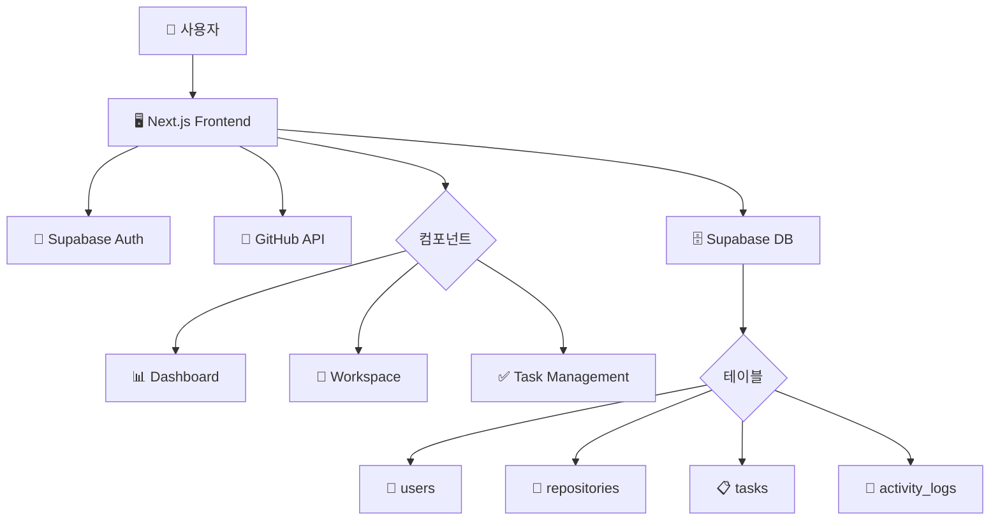

# System Overview

## 🎯 프로젝트 목표
GitHub 저장소를 AI 도움으로 효율적으로 관리하는 웹 애플리케이션 개발

## 🏗️ 시스템 아키텍처



## 🔧 기술 스택

### Frontend
- **Framework**: Next.js 15 (App Router)
- **Language**: TypeScript 5.x
- **UI Library**: React 19
- **Styling**: Tailwind CSS + shadcn/ui
- **State Management**: TanStack Query + Zustand
- **Build Tool**: Turbopack

### Backend Services
- **Authentication**: Supabase Auth
- **Database**: PostgreSQL (Supabase)
- **File Storage**: Supabase Storage
- **External API**: GitHub REST API v4

### Development Tools
- **Package Manager**: npm
- **Linting**: ESLint + TypeScript ESLint
- **Testing**: Jest + React Testing Library
- **Version Control**: Git + GitHub

## 🌊 데이터 플로우

1. **인증 플로우**
   ```
   사용자 → GitHub OAuth → Supabase Auth → 세션 생성
   ```

2. **저장소 관리 플로우**
   ```
   GitHub API → 저장소 목록 → Supabase DB → Frontend 표시
   ```

3. **태스크 관리 플로우**
   ```
   사용자 입력 → 태스크 생성 → DB 저장 → 실시간 동기화
   ```

## 🔒 보안 고려사항
- GitHub Personal Access Token 암호화 저장
- Row Level Security (RLS) 정책 적용
- HTTPS 통신 강제
- XSS/CSRF 보호

## 📈 성능 최적화
- React Query를 통한 캐싱 및 백그라운드 동기화
- 가상화를 통한 대용량 데이터 렌더링
- 이미지 최적화 (Next.js Image)
- 코드 스플리팅

## 🔄 향후 확장 계획
- AI 기반 코드 분석 기능
- 팀 협업 기능
- 실시간 알림 시스템
- 모바일 반응형 최적화